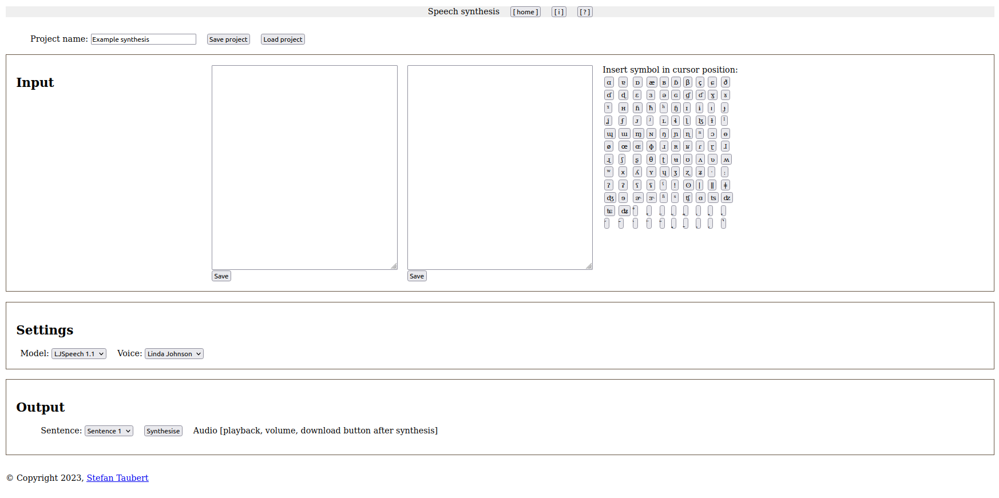

# Project Description
This project focuses on developing a graphical interface in Django for tools for synthesizing speech developed by [@stefantaubert](https://github.com/stefantaubert).


# Contributions, Citations, License
If you're intrested in contributing to the project, want to cite it or find out more about it, please contact its owner, [@stefantaubert](https://github.com/stefantaubert).

# Viewing and Running Project Locally
1. Create a local copy of the repository on your machine
Open Terminal and move to a directory where you want to create the copy. Then, type in your Terminal window:
a. with HTTPS:
```
git clone https://github.com/ntlprzybysz/synthesis-gui.git
```
b. with SSH:
```
git clone git@github.com:ntlprzybysz/synthesis-gui.git
```

2. Move to the directory of the repository
```
cd synthesis-gui
```

3. Create a virtual environment
```
pipenv shell --python 3.11
```

a. If there's no `(synthesis-gui)` in front of your username in Terminal, activate the virtual environment
```
pipenv shell
```

4. Install dependencies of the project in your virtual environment
```
pip3 install -r requirements.txt
```

5. Run a local server to see the website
```
python manage.py runserver
```

6. Open the website in your browser
Visit http://localhost:8000/synthesis/

7. If you're done, close the server
Press CTRL + C

8. Deactivate the virtual environment
```
deactivate
```
