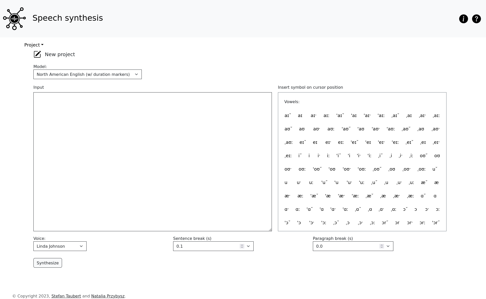

# Project Description
“Speech synthesis” is a mobile-friendly graphical interface for command line tools developed by [@stefantaubert](https://github.com/stefantaubert) that generate speech based on a text in the International Phonetic Alphabet (IPA). The models used in the synthesis were trained using audio recordings of native and non-native speakers of English, allowing the generation of speech as if it was produced by a speaker of a specific origin.

The primary tool featured in this GUI is a CLI designed for training Tacotron 2 using .wav and .TextGrid pairs. You can [explore the repository for Tacotron on GitHub](https://github.com/stefantaubert/tacotron) to learn more. The second tool is a CLI WaveGlow that is used for training WaveGlow with .wav files. [See Waveglow on Github](https://github.com/stefantaubert/waveglow). You can [listen to an audio sample of a synthesized text](https://tuc.cloud/index.php/s/gzaYDNKinHw6GCz): "The North Wind and the Sun were disputing which was the stronger, when a traveler came along wrapped in a warm cloak" (headphones recommended).

The web interface incorporates technologies such as Django, Bootstrap, Gunicorn, Nginx, RabbitMQ, Celery and Celery Beat and it is written in JavaScript, HTML, CSS and Python.

# Usage
At the top of the page, there is a dropdown menu labeled “Project” that allows users to perform bulk changes on input fields. These changes include resetting all fields to default values, saving all field values to a formatted *.txt file, or loading a previously saved project from a *.txt file. Users can also load an example that populates the input fields with sample synthesis data.

Below the dropdown menu, users are expected to choose a model trained for processing the input. Each model has a name, symbol range, supported speakers, languages, and accents. Upon selecting the model, options available in the selected model adjust automatically for the user.

Users are expected to input a text that they want to be synthesized using IPA symbols. To help input characters that are not on a keyboard, there is an IPA chart with commonly used IPA characters in combinations accepted by the chosen model. Clicking on a button inserts the selected combination at the cursor position in the IPA area field and adds the necessary separator “|”.

The IPA text must follow a specific format because the speech-dataset-parser can interpret a limited number of combinations. For example, a user must include stress marks on a vowel of a syllable (e.g., b|ˈo|d|i instead of ˈb|o|d|i) and separate phonemes into single intervals with the separator “|” (e.g., s|ˌɪ|ɡ|ɝ|ˈɛ|t).

The “Paragraph Break” and “Sentence Break” fields are adjusted based on the number of paragraphs and sentences in the IPA input field. These fields are values meant to be used in the future by the backend tools to further cutsomize the audio generation.

To initiate processing of the input, users are expected to click the “Synthesize” button. While the input is being processed, the button will be replaced with a message: “Synthesizing, please wait. This can take a few minutes.” and a progress indicator in percentages will keep updating itself. Once the audio is ready, options to download it and play it back with an audio player appear.

# Technical Information
The application is accessible via the university network with a link. A request is sent to a server hosted by the university, which is running [Nginx](https://docs.nginx.com/nginx/admin-guide/installing-nginx/installing-nginx-open-source/) as a reverse proxy server. Nginx receives information from [Gunicorn](https://gunicorn.org/) about the application. [RabbitMQ](https://rabbitmq.com/) is used to manage the message queue between the website and the [Celery](https://docs.celeryq.dev/en/stable/) worker, which periodically checks the logs and sends status updates to the maintainer.

The frontend was developed using [Bootstrap](https://getbootstrap.com/), a framework that provides ready-made elements, such as buttons, navigation, and other interface components that can be customized and embedded into a website via HTML tags. Custom HTML, CSS, and JavaScript were added to address gaps not covered by Bootstrap, such as communication with the Django backend and providing application-specific feedback to the user. The frontend was designed to be responsive, mobile-friendly, and compliant with common accessibility standards checked by [Wave](https://wave.webaim.org/help).

The backend was written in Python using the [Django](https://www.djangoproject.com/) web development framework, which provides common elements needed for building a web page that can receive forms, process them, save them, and present them. The data received from the form is processed with Celery, ensuring that the website remains available while an audio file is being generated. The input processing occurs in two stages: synthesizing the text into a mel-spectrogram and converting it into audio files. To achieve this, the original command line tools are called with the user’s input. The command line tools are based on Tacotron 2 and Waveglow, a [text-to-speech system](https://pytorch.org/hub/nvidia_deeplearningexamples_tacotron2/) that generates natural-sounding speech based on a text transcript.

# Contributions, Citations, License
If you're intrested in contributing to the project, want to cite it or find out more about it, please contact its owner, [@stefantaubert](https://github.com/stefantaubert).

# Viewing and Running Project Locally
The application is accessible via [the university network](https://www.tu-chemnitz.de/urz/network/access/vpn.html.en) with a link. 

For running the project locally, please see [the branch production](https://github.com/ntlprzybysz/synthesis-gui/tree/production) of this project. The project was saved there at a point easy to replicate for generic purpouses. Feel free to reuse any part of the code on any branch.