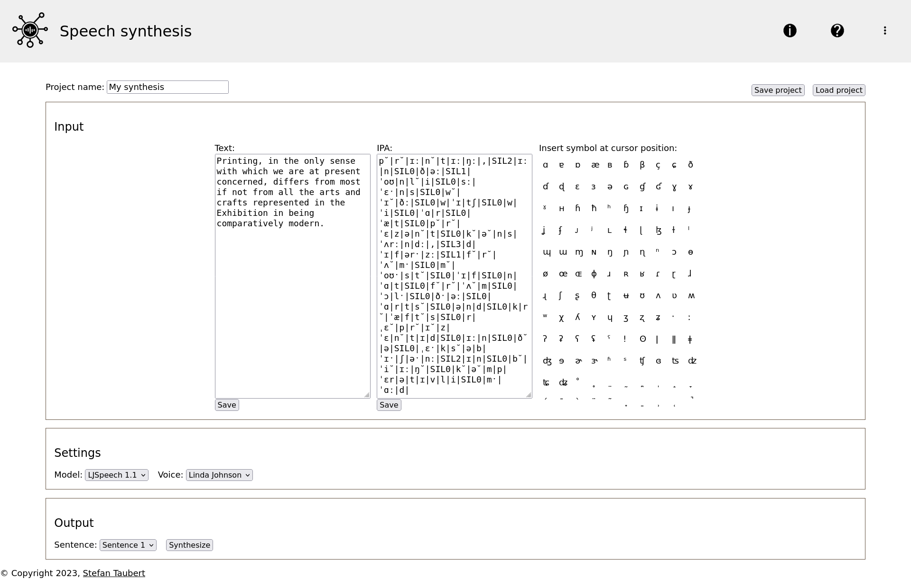

# Project Description
This project focuses on developing a graphical interface in Django for tools for synthesizing speech developed by [@stefantaubert](https://github.com/stefantaubert).


# Contributions, Citations, License
If you're intrested in contributing to the project, want to cite it or find out more about it, please contact its owner, [@stefantaubert](https://github.com/stefantaubert).

# Viewing and Running Project Locally

## Prerequisites

Please make sure that you have installed globally:
- Python 3.10 for working with Python scripts,
- pip for installing packages,
- pyenv for creating a virtual environment.

## Installation

1. Create a local copy of the repository on your machine. 

Move to the directory where you want to hold the project. Then, to create a local copy of the repository, type in your Terminal window:
```
git clone git@github.com:ntlprzybysz/synthesis-gui.git
```

2. Move to the directory of the project:
```
cd synthesis-gui
```

3. Create a virtual environment within the directory:
```
pipenv --python3.10
```
If pipenv installs the virtual environment with a Python version different than the specified version 3.10, please go to step 3a. Otherwise, please go to step 3b.

3a. If pipenv installs the virtual environment with a Python version different than the specified version 3.10, please remove the newly created environment:
```
pipenv --rm
```
Close the terminal window, open a new terminal window and navigate back to the project directory with `cd synthesis-gui`. Then, find your path to python3.10:
```
which python3.10
```
Install the virtual environment with the given path:
```
pipenv shell --python /your/path/python3.10
```

3b. If there's no `(synthesis-gui)` in front of your username in your terminal window, the virtual environment you just created isn't active. Please activate it:
```
pipenv shell
```

4. Install dependencies of the project within your virtual environment:
```
pip3 install -r requirements.txt
```

5. Download models for synthesis:

Set project variables by adjusting the path to your repository accordingly:
```
REPOSITORY_DIR="/your/path/to/synthesis-gui"
TOOLS_DIR="$REPOSITORY_DIR/synthesis/static/tools"
```
Download the models:
```
wget "https://tuc.cloud/index.php/s/LH4Zzn7fPMb2w6s/download/101000.pt" -O "$TOOLS_DIR/tacotron.pt"
wget "https://tuc.cloud/index.php/s/yBRaWz5oHrFwigf/download/LJS-v3-580000.pt" -O "$TOOLS_DIR/waveglow.pt"
```
Your project structure should like like this now (it's okay if "media" folder is missing. It will be created as soon as you synthesize):
```
synthesis-gui
├── db.sqlite3
├── manage.py
├── media
├── Pipfile
├── Pipfile.lock
├── README.md
├── requirements.txt
├── Screenshot_2023-06-21.png
├── synthesis
│   ├── admin.py
│   ├── apps.py
│   ├── forms.py
│   ├── __init__.py
│   ├── migrations
│   │   ├── __init__.py
│   │   └── __pycache__
│   │       └── ...
│   ├── models.py
│   ├── __pycache__
│   │   └── ...
│   ├── static
│   │   ├── base.css
│   │   ├── main.js
│   │   └── tools
│   │       ├── tacotron.pt
│   │       └── waveglow.pt
│   ├── templates
│   │   ├── about.html
│   │   ├── help.html
│   │   ├── home.html
│   │   └── synthesized.html
│   ├── tests.py
│   ├── urls.py
│   └── views.py
└── synthesisgui
    ├── asgi.py
    ├── __init__.py
    ├── __pycache__
    │   └── ...
    ├── settings.py
    ├── urls.py
    └── wsgi.py
```

6. Run a local server for the website:
```
python manage.py runserver
```

7. Open the website in your browser by visiting http://localhost:8000/synthesis/.

8. If you're done, close the server by pressing `CTRL` + `C`.

9. Deactivate the virtual environment:
```
deactivate
```

## Hiding SECRET_KEY 

*** Before publishing your code with a version control system or deploying the website, *** make sure that your `SECRET_KEY` variable from `settings.py` is hidden for security reasons.

1. Create a `.env` file in your project directory (no name, just extension .env) and copy-paste `SECRET_KEY` variable from `settings.py`. Make sure to delete both the spaces before the equal sign as well as the quotation marks. For instance, if your `settings.py` included `SECRET_KEY = 'mysecretkey1234567890'`, your `.env` file should contain `SECRET_KEY=mysecretkey1234567890`.

2. Modify your settings.py file to read the SECRET_KEY from the environment variable by adding the import and overwrwrite the `SECRET_KEY` as follows:

```
import os
SECRET_KEY = os.environ.get('SECRET_KEY')
```

3. If you use Git for version control, create a file `.gitgnore` in the directory of your repository and add the line:
```
.env
```
This ensures Git doesn't keep track of and will not publish this file even though it's in the tracked repository.

4. Set the environment variable when running your application:

```
export SECRET_KEY=mysecretkey1234567890
python manage.py runserver
```